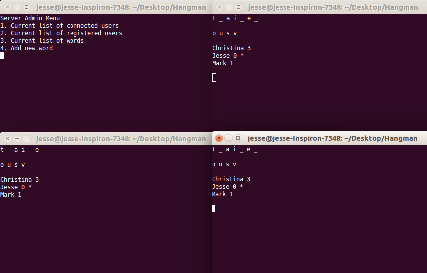

# Hangman

Written using Python 3.6.1

A terminal-based version of the classic multiplayer game Hangman. This project is meant to showcase my knowledge of threading as well as blocking/non-blocking sockets. The game is run by a server and clients connect to the server via Telnet. The server supports running multiple games at a time.

To run this game open up a minimum of two terminals. One terminal should be in the same directory as server.py.

Run "python server.py" in one of the open terminals.

The other terminal will connect to the server using telnet.
Use the command "telnet localhost 8238" to connect to the server.
